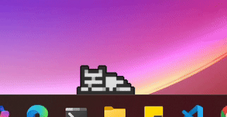

# Desktop Pet

A cute virtual pet that chills on your desktop

## How this works

First, I got an [spritesheet](cat_spritesheet.png) of a little cat from https://elthen.itch.io/2d-pixel-art-cat-sprites.

Then I cut up the spritesheet using [create_gifs.py](create_gifs.py) and created [gifs](cat_gifs/) for each row of sprites.

Using those gifs, in [pet.py](pet.py), I display the cat the in a window that is transparent and always on top. I also added random little behaviours like licking and sleeping.

The pet is very customizable by adding new animations and coding in new behaviours.

## Additions/Improvements

Here are some things that I would add or improve on:
- Interactions with the pet such as clicking and dragging
- Items that it can interact with
- Particles and effects